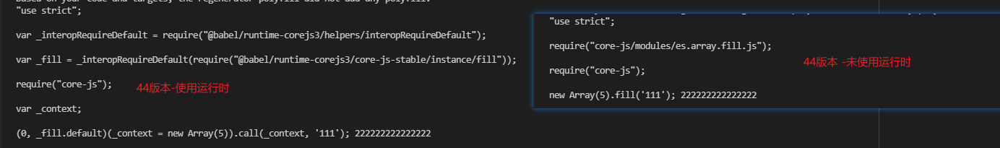

### babel7 测试运行时装包注意
@babel/plugin-transform-runtime

### @babel/plugin-transform-runtime
将全局的模块变成了模块化引入

### @babel/plugin-transform-runtime的问题
它不支持配置 targets 的，因为不知道目标环境支持啥，它只能全部做转换。你可能说不是有 preset-env 么？

babel 中插件的应用顺序是：先 plugin 再 preset，plugin 从左到右，preset 从右到左，这样 plugin-transform-runtime 是在 preset-env 前面的。

等 @babel/plugin-transform-runtime 转完了之后，再交给 preset-env 这时候已经做了无用的转换了。

